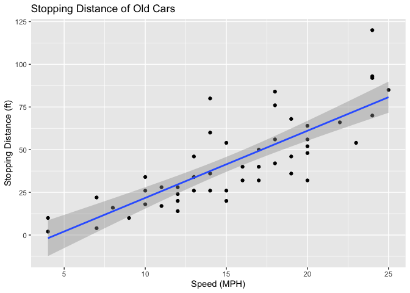
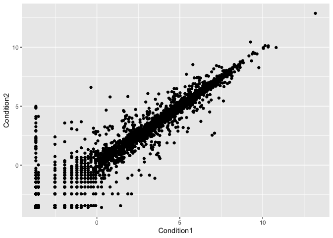
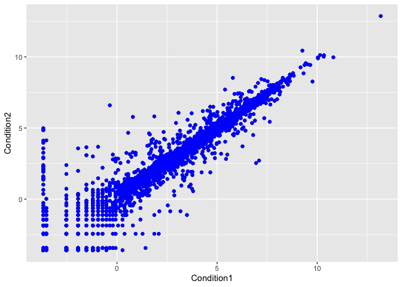
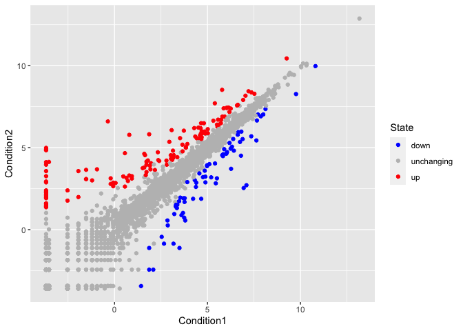
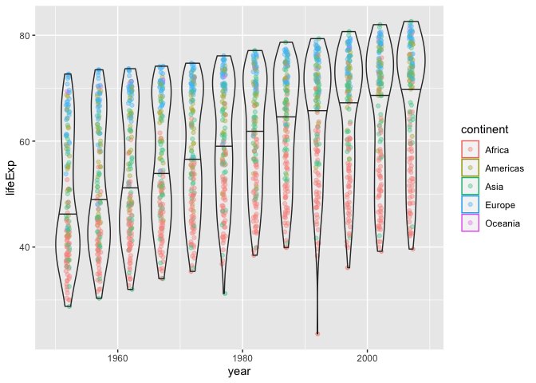

Data Visualization
================
barry
2021-12-03

``` r
# Class 05: Data Visualization

# Today we are going to use ggplot2 package

# First we need to load the package!
# install.packages("ggplot2")
library(ggplot2)

# We will use this inbuilt "cars" dataset first
head(cars)
```

    ##   speed dist
    ## 1     4    2
    ## 2     4   10
    ## 3     7    4
    ## 4     7   22
    ## 5     8   16
    ## 6     9   10

``` r
# All ggplots have at least 3 layers,
#  data + aes + geoms
ggplot(data=cars) +
  aes(x=speed, y=dist) +
  geom_point() +
  geom_smooth(method="lm") +
  labs(title="Stopping Distance of Old Cars",
       x="Speed (MPH)", 
       y="Stopping Distance (ft)")
```

    ## `geom_smooth()` using formula 'y ~ x'

<!-- -->

``` r
# Side-note: ggplot is not the only graphics system
# a very popular one is good old "base" R graphcs
plot(cars)
```

<!-- -->

``` r
# Plot some gene expression results.
# Dataset is online in tab separated format so we
# use the read.delim() function to import into R

url <- "https://bioboot.github.io/bimm143_S20/class-material/up_down_expression.txt"
genes <- read.delim(url)
head(genes)
```

    ##         Gene Condition1 Condition2      State
    ## 1      A4GNT -3.6808610 -3.4401355 unchanging
    ## 2       AAAS  4.5479580  4.3864126 unchanging
    ## 3      AASDH  3.7190695  3.4787276 unchanging
    ## 4       AATF  5.0784720  5.0151916 unchanging
    ## 5       AATK  0.4711421  0.5598642 unchanging
    ## 6 AB015752.4 -3.6808610 -3.5921390 unchanging

``` r
# Q. How many genes in this dataset
nrow(genes)
```

    ## [1] 5196

``` r
# Q. How many genes are "up"?
table(genes$State)
```

    ## 
    ##       down unchanging         up 
    ##         72       4997        127

``` r
# Q. What % are up?
round( table(genes$State)/nrow(genes) * 100, 3 )
```

    ## 
    ##       down unchanging         up 
    ##      1.386     96.170      2.444

``` r
# Lets make a figure
p <- ggplot(genes) +
  aes(x=Condition1, y=Condition2) +
  geom_point()

p
```

<!-- -->

``` r
# Yuk!
p + geom_point(col="blue")
```

<!-- -->

``` r
# Nicer color by State column in data
p <- p + aes(col=State) 


# I like it but not the default colors, let's change them
p + scale_color_manual(values=c("blue", "gray", "red"))
```

<!-- -->

``` r
# Lets explore the gapminder dataset
# install.packages("gapminder")
library(gapminder)
head(gapminder)
```

    ## # A tibble: 6 × 6
    ##   country     continent  year lifeExp      pop gdpPercap
    ##   <fct>       <fct>     <int>   <dbl>    <int>     <dbl>
    ## 1 Afghanistan Asia       1952    28.8  8425333      779.
    ## 2 Afghanistan Asia       1957    30.3  9240934      821.
    ## 3 Afghanistan Asia       1962    32.0 10267083      853.
    ## 4 Afghanistan Asia       1967    34.0 11537966      836.
    ## 5 Afghanistan Asia       1972    36.1 13079460      740.
    ## 6 Afghanistan Asia       1977    38.4 14880372      786.

``` r
# Let's make a new plot of year vs lifeExp
ggplot(gapminder) +
  aes(x=year, y=lifeExp, col=continent) +
  geom_jitter(width=0.3,alpha=0.4) +
  geom_violin( aes(group=year), alpha=0.2,
               draw_quantiles = 0.5)
```

<!-- -->

``` r
# Install the plotly
# install.packages("plotly")
#library(plotly)
#ggplotly()
```
