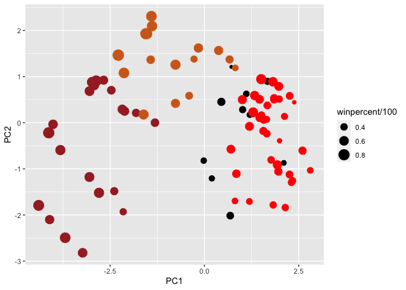

```{=html}
<style> 
h1, .h1 {
    margin-top: 50px;
}
h2, .h2, h3, .h3 {
    margin-top: 30px;
}
body{
  font-size: 12pt;
}
.q_box { 
  display: block;
  border: 1px solid Gray; 
  border-radius: 8px;
    width: 90%;
    left: 6px;
    padding: 5px 5px 5px 15px;
    color: Red;
    margin-top: 20px;
    margin-bottom: 25px;
}
.image-left {
  display: block;
  margin-left: auto;
  margin-right: auto;
  float: left;
}
.image-right {
  display: block;
  margin-left: auto;
  margin-right: auto;
  float: right;
}
</style>
```
Barry Grant \< <http://thegrantlab.org/teaching/> \>\
2021-10-26 (19:58:47 PDT on Tue, Oct 26)

# Background

::: {style="float: right"}
{width="318"}
:::

In this mini-project, you will explore FiveThirtyEight's [Halloween Candy dataset](https://github.com/fivethirtyeight/data/tree/master/candy-power-ranking). FiveThirtyEight, sometimes rendered as just [**538**](https://fivethirtyeight.com), is an American website that focuses mostly on opinion poll analysis, politics, economics, and sports blogging. They recently ran a rather large poll to determine which candy their readers like best. From their website: *"While we don't know who exactly voted, we do know this: 8,371 different IP addresses voted on about 269,000 randomly generated candy matchups"*. 

So what is the top ranked snack-sized Halloween candy? What made some candies more desirable than others? Was it price? Maybe it was just sugar content? Were they chocolate? Did they contain peanuts or almonds? How about crisped rice or other biscuit-esque component, like a Kit Kat or malted milk ball? Was it fruit flavored? Was it made of hard candy, like a lollipop or a strawberry bon bon? Was there nougat? What even is nougat? I know I like nougat, but I still have no real clue what the damn thing is.

> Your task is to explore their candy dataset to find out answers to these types of questions - but most of all your job is to have fun, learn by doing hands on data analysis, and hopefully make this type of analysis less frightining for the future! **Let's get started.**

# 1. Importing candy data


First things first, let's get the data from the FiveThirtyEight GitHub repo. You can either read from the URL directely or download this [candy-data.csv](https://raw.githubusercontent.com/fivethirtyeight/data/master/candy-power-ranking/candy-data.csv) file and place it in your project directory. Either way we need to load it up with `read.csv()` and inspect the data to see exactly what we're dealing with.


```r
candy_file <- "candy-data.csv"

candy = ____(____, row.names=1)
head(candy)
```

<div data-pagedtable="false">
  <script data-pagedtable-source type="application/json">
{"columns":[{"label":[""],"name":["_rn_"],"type":[""],"align":["left"]},{"label":["chocolate"],"name":[1],"type":["int"],"align":["right"]},{"label":["fruity"],"name":[2],"type":["int"],"align":["right"]},{"label":["caramel"],"name":[3],"type":["int"],"align":["right"]},{"label":["peanutyalmondy"],"name":[4],"type":["int"],"align":["right"]},{"label":["nougat"],"name":[5],"type":["int"],"align":["right"]},{"label":["crispedricewafer"],"name":[6],"type":["int"],"align":["right"]},{"label":["hard"],"name":[7],"type":["int"],"align":["right"]},{"label":["bar"],"name":[8],"type":["int"],"align":["right"]},{"label":["pluribus"],"name":[9],"type":["int"],"align":["right"]},{"label":["sugarpercent"],"name":[10],"type":["dbl"],"align":["right"]},{"label":["pricepercent"],"name":[11],"type":["dbl"],"align":["right"]},{"label":["winpercent"],"name":[12],"type":["dbl"],"align":["right"]}],"data":[{"1":"1","2":"0","3":"1","4":"0","5":"0","6":"1","7":"0","8":"1","9":"0","10":"0.732","11":"0.860","12":"66.97173","_rn_":"100 Grand"},{"1":"1","2":"0","3":"0","4":"0","5":"1","6":"0","7":"0","8":"1","9":"0","10":"0.604","11":"0.511","12":"67.60294","_rn_":"3 Musketeers"},{"1":"0","2":"0","3":"0","4":"0","5":"0","6":"0","7":"0","8":"0","9":"0","10":"0.011","11":"0.116","12":"32.26109","_rn_":"One dime"},{"1":"0","2":"0","3":"0","4":"0","5":"0","6":"0","7":"0","8":"0","9":"0","10":"0.011","11":"0.511","12":"46.11650","_rn_":"One quarter"},{"1":"0","2":"1","3":"0","4":"0","5":"0","6":"0","7":"0","8":"0","9":"0","10":"0.906","11":"0.511","12":"52.34146","_rn_":"Air Heads"},{"1":"1","2":"0","3":"0","4":"1","5":"0","6":"0","7":"0","8":"1","9":"0","10":"0.465","11":"0.767","12":"50.34755","_rn_":"Almond Joy"}],"options":{"columns":{"min":{},"max":[10]},"rows":{"min":[10],"max":[10]},"pages":{}}}
  </script>
</div>

### What is in the dataset?

The dataset includes all sorts of information about different kinds of candy. For example, is a candy chocolaty? Does it have nougat? How does its cost compare to other candies? How many people prefer one candy over another?

According to 538 the columns in the dataset include:

-   **chocolate**: Does it contain chocolate?
-   **fruity**: Is it fruit flavored?
-   **caramel**: Is there caramel in the candy?
-   **peanutyalmondy**: Does it contain peanuts, peanut butter or almonds?
-   **nougat**: Does it contain nougat?
-   **crispedricewafer**: Does it contain crisped rice, wafers, or a cookie component?
-   **hard**: Is it a hard candy?
-   **bar**: Is it a candy bar?
-   **pluribus**: Is it one of many candies in a bag or box?
-   **sugarpercent**: The percentile of sugar it falls under within the data set.
-   **pricepercent**: The unit price percentile compared to the rest of the set.
-   **winpercent**: The overall win percentage according to 269,000 matchups (more on this in a moment).

> We will take a whirlwind tour of this dataset and in the process answer the questions highlighted in red throught this page that aim to guide your exploration process. We will then wrap up by trying Principal Component Analysis (PCA) on this dataset to get yet more experience with this important multivariate method. It will yield a kind of *"Map of Hallowen Candy Space"*. How cool is that! Let's explore...

::: {.q_box}
-   **Q1**. How many different candy types are in this dataset?
-   **Q2**. How many fruity candy types are in the dataset?

> The functions `dim()`, `nrow()`, `table()` and `sum()` may be useful for answering the first 2 questions.
:::

# 2. What is your favorate candy?

One of the most interesting variables in the dataset is `winpercent`. For a given candy this value is the percentage of people who prefer this candy over another randomly chosen candy from the dataset (what 538 term a matchup). Higher values indicate a more popular candy.


We can find the `winpercent` value for Twix by using its name to access the corresponding row of the dataset. This is because the dataset has each candy name as `rownames` (recall that we set this when we imported the original CSV file). For example the code for Twix is:


```r
candy["Twix", ]$winpercent
```

```
## [1] 81.64291
```

::: {.q_box}
- **Q3**. What is your favorite candy in the dataset and what is it's `winpercent` value?
- **Q4**. What is the `winpercent` value for "Kit Kat"?
- **Q5**. What is the `winpercent` value for "Tootsie Roll Snack Bars"?
:::


> **Side-note**: the skimr::skim() function
>
> There is a useful `skim()` function in the **skimr** package that can help give you a quick overview of a given dataset. Let's install this package and try it on our candy data.
> 
> 
> ```r
> library("skimr")
> skim(candy)
> ```
> 
> 
> Table: Data summary
> 
> |                         |      |
> |:------------------------|:-----|
> |Name                     |candy |
> |Number of rows           |85    |
> |Number of columns        |12    |
> |_______________________  |      |
> |Column type frequency:   |      |
> |numeric                  |12    |
> |________________________ |      |
> |Group variables          |None  |
> 
> 
> **Variable type: numeric**
> 
> |skim_variable    | n_missing| complete_rate|  mean|    sd|    p0|   p25|   p50|   p75|  p100|hist  |
> |:----------------|---------:|-------------:|-----:|-----:|-----:|-----:|-----:|-----:|-----:|:-----|
> |chocolate        |         0|             1|  0.44|  0.50|  0.00|  0.00|  0.00|  1.00|  1.00|▇▁▁▁▆ |
> |fruity           |         0|             1|  0.45|  0.50|  0.00|  0.00|  0.00|  1.00|  1.00|▇▁▁▁▆ |
> |caramel          |         0|             1|  0.16|  0.37|  0.00|  0.00|  0.00|  0.00|  1.00|▇▁▁▁▂ |
> |peanutyalmondy   |         0|             1|  0.16|  0.37|  0.00|  0.00|  0.00|  0.00|  1.00|▇▁▁▁▂ |
> |nougat           |         0|             1|  0.08|  0.28|  0.00|  0.00|  0.00|  0.00|  1.00|▇▁▁▁▁ |
> |crispedricewafer |         0|             1|  0.08|  0.28|  0.00|  0.00|  0.00|  0.00|  1.00|▇▁▁▁▁ |
> |hard             |         0|             1|  0.18|  0.38|  0.00|  0.00|  0.00|  0.00|  1.00|▇▁▁▁▂ |
> |bar              |         0|             1|  0.25|  0.43|  0.00|  0.00|  0.00|  0.00|  1.00|▇▁▁▁▂ |
> |pluribus         |         0|             1|  0.52|  0.50|  0.00|  0.00|  1.00|  1.00|  1.00|▇▁▁▁▇ |
> |sugarpercent     |         0|             1|  0.48|  0.28|  0.01|  0.22|  0.47|  0.73|  0.99|▇▇▇▇▆ |
> |pricepercent     |         0|             1|  0.47|  0.29|  0.01|  0.26|  0.47|  0.65|  0.98|▇▇▇▇▆ |
> |winpercent       |         0|             1| 50.32| 14.71| 22.45| 39.14| 47.83| 59.86| 84.18|▃▇▆▅▂ |

From your use of the `skim()` function use the output to answer the following:

::: {.q_box}
- **Q6**. Is there any variable/column that looks to be on a different scale to the majority of the other columns in the dataset?
- **Q7**. What do you think a zero and one represent for the `candy$chocolate` column?

> **Hint**: look at the "Variable type" print out from the `skim()` function. Most varables (i.e. columns) are on the zero to one scale but not all. Some columns such as `chocolate` are exclusively either zero or one values.
:::


A good place to start any exploratory analysis is with a histogram. You can do this most easily with the base R function `hist()`. Alternatively, you can use `ggplot()` with `geom_hist()`. Either works well in this case and (as always) its your choice.

::: {.q_box}
- **Q8**. Plot a histogram of `winpercent` values
- **Q9**. Is the distribution of `winpercent` values symmetrical? 
- **Q10**. Is the center of the distribution above or below 50%?
- **Q11**. On average is chocolate candy higher or lower ranked than fruit candy?
- **Q12**. Is this difference statistically significant? 

> **Hint**: The `chocolate`, `fruity`, `nougat` etc. columns indicate if a given candy has this feature (i.e. one if it has nougart, zero if it does not etc.). We can turn these into **logical** (a.k.a. TRUE/FALSE) values with the `as.logical()` function. We can then use this logical vector to access the coresponding candy rows (those with TRUE values).  For example to get the `winpercent` values for all nougat contaning candy we can use the code: `candy$winpercent[as.logical(candy$nougat)]`. In addation the functions `mean()` and `t.test()` should help you answer the last two questions here.  


```
## 
## 	Welch Two Sample t-test
## 
## data:  chocolate and fruity
## t = 6.2582, df = 68.882, p-value = 2.871e-08
## alternative hypothesis: true difference in means is not equal to 0
## 95 percent confidence interval:
##  11.44563 22.15795
## sample estimates:
## mean of x mean of y 
##  60.92153  44.11974
```
:::


# 3. Overall Candy Rankings

Let's use the base R `order()` function together with `head()` to sort the whole dataset by `winpercent`. Or if you have been getting into the tidyverse and the **dplyr** package you can use the `arrange()` function together with `head()` to do the same thing and answer the following questions:


::: {.q_box}
- **Q13**. What are the five least liked candy types in this set?
- **Q14**. What are the top 5 all time favorite candy types out of this set?

> **Hint**: Using base R we could use `head(candy[order(candy$winpercent),], n=5)`, whilst using **dplyr** we have: `candy %>% arrange(winpercent) %>% head(5)`. Which apprach do you prefer and why?
:::


To examine more of the dataset in this vain we can make a barplot to visualize the overall rankings. We will use an iterative approach to building a useful visulization by getting a rough starting plot and then refining and adding useful details in a stepwise process. 

::: {.q_box}
- **Q15**. Make a first barplot of candy ranking based on `winpercent` values.

> **HINT**: Use the `aes(winpercent, rownames(candy))` for your first ggplot like so:   


```r
library(____)

ggplot(____) + 
  aes(winpercent, rownames(candy)) +
  geom_____()
```

<!-- -->


- **Q16**. This is quite ugly, use the `reorder()` function to get the bars sorted by `winpercent`?

> **HINT**: You can use `aes(winpercent, reorder(rownames(candy),winpercent))` to improve your plot.

<!-- -->

:::

### Time to add some useful color

Let's setup a color vector (that signifies candy type) that we can then use for some future plots. We start by making a vector of all black values (one for each candy). Then we overwrite chocolate (for chocolate candy), brown (for candy bars) and red (for fruity candy) values.


```r
my_cols=rep("black", nrow(candy))
my_cols[as.logical(candy$chocolate)] = "chocolate"
my_cols[as.logical(candy$bar)] = "brown"
my_cols[as.logical(candy$fruity)] = "pink"
```

Now let's try our barplot with these colors. Note that we use `fill=my_cols` for `geom_col()`. Experement to see what happens if you use `col=mycols`.


```r
ggplot(candy) + 
  aes(winpercent, reorder(rownames(candy),winpercent)) +
  geom_col(fill=my_cols) 
```

<!-- -->

::: {.q_box}
Now, for the first time, using this plot we can answer questions like:   
- **Q17**. What is the worst ranked chocolate candy?  
- **Q18**. What is the best ranked fruity candy?

:::


 

# 4. Taking a look at pricepercent

What about value for money? What is the the best candy for the least money? One way to get at this would be to make a plot of `winpercent` vs the `pricepercent` variable. The `pricepercent` variable records the percentile rank of the candy's price against all the other candies in the dataset. Lower vales are less expensive and high values more expensive.

To this plot we will add text labels so we can more easily identify a given candy. There is a regular `geom_label()` that comes with ggplot2. However, as there are quite a few candys in our dataset lots of these labels will be overlapping and hard to read. To help with this we can use the `geom_text_repel()` function from the **ggrepel** package.


```r
library(ggrepel)

# How about a plot of price vs win
ggplot(candy) +
  aes(winpercent, pricepercent, label=rownames(candy)) +
  geom_point(col=my_cols) + 
  geom_text_repel(col=my_cols, size=3.3, max.overlaps = 5)
```

```
## Warning: ggrepel: 50 unlabeled data points (too many overlaps). Consider
## increasing max.overlaps
```

<!-- -->

::: {.q_box}
- **Q19**. Which candy type is the highest ranked in terms of `winpercent` for the least money - i.e. offers the most bang for your buck?
- **Q20**. What are the top 5 most expensive candy types in the dataset and of these which is the least popular?

> **Hint**: To see which candy is the most expensive (and which is the least expensive) we can `order()` the dataset by `pricepercent`.
> 
> 
> ```r
> ord <- order(candy$pricepercent, decreasing = TRUE)
> head( candy[ord,c(11,12)], n=5 )
> ```
> 
> <div data-pagedtable="false">
>   <script data-pagedtable-source type="application/json">
> {"columns":[{"label":[""],"name":["_rn_"],"type":[""],"align":["left"]},{"label":["pricepercent"],"name":[1],"type":["dbl"],"align":["right"]},{"label":["winpercent"],"name":[2],"type":["dbl"],"align":["right"]}],"data":[{"1":"0.976","2":"22.44534","_rn_":"Nik L Nip"},{"1":"0.976","2":"37.88719","_rn_":"Nestle Smarties"},{"1":"0.965","2":"35.29076","_rn_":"Ring pop"},{"1":"0.918","2":"62.28448","_rn_":"Hersheys Krackel"},{"1":"0.918","2":"56.49050","_rn_":"Hersheys Milk Chocolate"}],"options":{"columns":{"min":{},"max":[10]},"rows":{"min":[10],"max":[10]},"pages":{}}}
>   </script>
> </div>

:::


----
::: {.q_box}
### Optional
- **Q21**. Make a barplot again with `geom_col()` this time using `pricepercent` and then improve this step by step, first ordering the x-axis by value and finally making a so called "dot chat" or "lollipop" chart by swapping `geom_col()` for `geom_point()` + `geom_segment()`. 

<!-- -->


```r
# Make a lollipop chart of pricepercent
ggplot(candy) +
  aes(pricepercent, reorder(rownames(candy), pricepercent)) +
  geom_segment(aes(yend = reorder(rownames(candy), pricepercent), 
                   xend = 0), col="gray40") +
    geom_point()
```

<!-- -->

One of the most interesting aspects of this chart is that a lot of the candies share the same ranking, so it looks like quite a few of them are the same price.
:::


# 5 Exploring the correlation structure

Now that we've explored the dataset a little, we'll see how the variables interact with one another. We'll use correlation and view the results with the **corrplot** package to plot a correlation matrix. 


```r
library(corrplot)
```

```
## corrplot 0.90 loaded
```

```r
cij <- cor(candy)
corrplot(cij)
```

<!-- -->

::: {.q_box}
- **Q22**. Examining this plot what two variables are anti-correlated (i.e. have minus values)? 
- **Q23**. Similarly, what two variables are most positively correlated?

> **HINT**: Do you like chocolaty fruity candies?
:::


# 6. Principal Component Analysis

Let's apply PCA using the `prcom()` function to our candy dataset remembering to set the `scale=TRUE` argument. 

> **Side-note**: Feel free to examine what happens if you leave this argument out (i.e. use the default `scale=FALSE`). Then examine the `summary(pca)` and `pca$rotation[,1]` component and see that it is dominated by `winpercent` (which is after all measured on a very different scale than the other variables).  


```r
pca <- ____(candy, ____)
summary(pca)
```


```
## Importance of components:
##                           PC1    PC2    PC3     PC4    PC5     PC6     PC7
## Standard deviation     2.0788 1.1378 1.1092 1.07533 0.9518 0.81923 0.81530
## Proportion of Variance 0.3601 0.1079 0.1025 0.09636 0.0755 0.05593 0.05539
## Cumulative Proportion  0.3601 0.4680 0.5705 0.66688 0.7424 0.79830 0.85369
##                            PC8     PC9    PC10    PC11    PC12
## Standard deviation     0.74530 0.67824 0.62349 0.43974 0.39760
## Proportion of Variance 0.04629 0.03833 0.03239 0.01611 0.01317
## Cumulative Proportion  0.89998 0.93832 0.97071 0.98683 1.00000
```

Now we can plot our main PCA score plot of PC1 vs PC2.


```r
plot(pca$____[,____])
```

<!-- -->

We can change the plotting character and add some color:


```r
plot(pca$x[,1:2], col=my_cols, pch=16)
```

<!-- -->

We can make a much nicer plot with the **ggplot2** package but it is important to note that ggplot works best when you supply an input data.frame that includes a separate column for each of the aesthetics you would like displayed in your final plot. To accomplish this we make a new data.frame here that contains our PCA results with all the rest of our candy data. We will then use this for making plots below


```r
# Make a new data-frame with our PCA results and candy data
my_data <- cbind(candy, pca$x[,1:3])
```


```r
p <- ggplot(my_data) + 
        aes(x=PC1, y=PC2, 
            size=winpercent/100,  
            text=rownames(my_data),
            label=rownames(my_data)) +
        geom_point(col=my_cols)

p
```

<!-- -->


Again we can use the  **ggrepel** package and the function `ggrepel::geom_text_repel()` to label up the plot with non overlapping candy names like. We will also add a title and subtitle like so:


```r
library(ggrepel)

p + geom_text_repel(size=3.3, col=my_cols, max.overlaps = 7)  + 
  theme(legend.position = "none") +
  labs(title="Halloween Candy PCA Space",
       subtitle="Colored by type: chocolate bar (dark brown), chocolate other (light brown), fruity (red), other (black)",
       caption="Data from 538")
```

<!-- -->
If you want to see more candy labels you can change the `max.overlaps` value to allow more overlapping labels or pass the ggplot object `p` to **plotly** like so to generate an interactive plot that you can mouse over to see labels:


```r
library(plotly)
```

```
## 
## Attaching package: 'plotly'
```

```
## The following object is masked from 'package:ggplot2':
## 
##     last_plot
```

```
## The following object is masked from 'package:stats':
## 
##     filter
```

```
## The following object is masked from 'package:graphics':
## 
##     layout
```

```r
ggplotly(p)
```

```{=html}
<div id="htmlwidget-a97b12ce13e90d3516ec" style="width:672px;height:480px;" class="plotly html-widget"></div>
<script type="application/json" data-for="htmlwidget-a97b12ce13e90d3516ec">{"x":{"data":[{"x":[-3.81986174503388,-2.79602363950231,1.20258363153398,0.448653778729298,0.702899221012636,-2.46833833744554,-4.1053122278249,0.713858129118798,1.01357204126823,0.810496447091984,-2.15436587401215,1.6526848199515,2.38180816620458,1.51249936212051,2.14430932583817,2.26133763048844,1.82383348383915,1.96047811604189,1.33360746377483,1.11167364512868,1.46152952265731,1.66849016477709,0.377226748518765,-3.04788356449615,-2.1169641707884,-2.17850375620271,2.62491586736997,-0.160106099988785,-2.87086546441501,1.65450041880429,2.33564695207072,1.19528766482954,-1.52223814442081,-0.76747560629036,1.57487290154029,-0.768369370306157,-3.69272218382141,-3.23036512681522,-3.04936226318081,-1.81292794659586,-2.67327849174607,1.93426894934829,-2.97855081253165,-2.92740487602397,1.63985272135148,1.98070982304195,-2.39180556077411,-1.38897068980852,1.67042227450824,1.76879348291907,2.12406848776733,-1.55210250971629,-2.28427984833487,-1.40590760892042,-2.13382398284567,1.1927441238739,-1.612593223317,2.10440254374384,2.25699184875304,0.817996643496473,1.29259128537844,1.47148517361253,-0.275565625133555,2.6011521390626,-4.39576791879576,-4.01457334793704,1.81551768640562,1.97326660392366,1.50658493291872,2.80647837337621,-0.0190055887408373,0.19642038204206,1.99242820123837,1.00547406616169,0.847341712460311,-0.404636665373278,0.667307323896273,-1.31149842017846,1.85048456356939,-4.12909043982995,1.56312583857338,2.30707033004499,1.84808800952644,0.684203632416203,-1.42549552497318],"y":[-0.593578766991287,-1.51960621114906,0.171812065653847,0.451973562149558,-0.573134326318843,0.703550112004644,-2.10009677361498,1.20982165367975,0.283431962119301,-1.6960889498265,-1.93042130373402,0.072643494363971,0.443092607073654,0.162395859152872,-1.83883861597069,0.581832251993653,-1.78286620940117,-1.05846802668948,0.589269992090871,0.625769780751658,0.507369148230095,0.374864626463833,1.5654519145146,0.68507927870811,0.250456889077493,0.289857005213092,-0.634367161781278,1.61944283469071,0.906965533504061,-0.237960514406945,-1.25534046463053,-0.0783610245800449,1.92913958898589,1.25735391355147,0.0664259745820513,0.419279394554339,-2.49333131729416,-2.82010313266632,-1.17747773044969,0.212072631223902,0.921720734412683,-0.913330722456282,0.879883536795828,0.811901315368094,0.421021732233104,0.511715091928334,-1.48396375121767,2.09471880310812,0.896979236450461,-0.806032564012231,0.136682295970891,1.92875697927713,1.46489232934648,2.30779848182035,1.07872896536254,-1.70697492835023,0.177373493169268,-0.871134055579113,-1.12231999339085,1.18882901220002,0.226370513705337,0.111835455906063,1.37923441372744,-0.604794752049091,-1.79193125161981,-0.034767352242769,0.887944521521587,0.786947323886418,0.943729083003744,-1.03311931114432,-0.821954229306548,-1.20736946982806,-0.391589864765991,0.50033270400461,-1.10606867102952,0.584858036202565,1.37094649798225,0.000972128574995524,0.530405516803958,-0.218029957329676,-0.179458835386825,-1.29402688248696,0.502200618377961,-2.01463854400684,1.36541477023411],"text":["PC1: -3.81986175<br />PC2: -0.5935787670<br />winpercent/100: 0.6697173<br />100 Grand<br />rownames(my_data): 100 Grand","PC1: -2.79602364<br />PC2: -1.5196062111<br />winpercent/100: 0.6760294<br />3 Musketeers<br />rownames(my_data): 3 Musketeers","PC1:  1.20258363<br />PC2:  0.1718120657<br />winpercent/100: 0.3226109<br />One dime<br />rownames(my_data): One dime","PC1:  0.44865378<br />PC2:  0.4519735621<br />winpercent/100: 0.4611650<br />One quarter<br />rownames(my_data): One quarter","PC1:  0.70289922<br />PC2: -0.5731343263<br />winpercent/100: 0.5234146<br />Air Heads<br />rownames(my_data): Air Heads","PC1: -2.46833834<br />PC2:  0.7035501120<br />winpercent/100: 0.5034755<br />Almond Joy<br />rownames(my_data): Almond Joy","PC1: -4.10531223<br />PC2: -2.1000967736<br />winpercent/100: 0.5691455<br />Baby Ruth<br />rownames(my_data): Baby Ruth","PC1:  0.71385813<br />PC2:  1.2098216537<br />winpercent/100: 0.2341782<br />Boston Baked Beans<br />rownames(my_data): Boston Baked Beans","PC1:  1.01357204<br />PC2:  0.2834319621<br />winpercent/100: 0.3801096<br />Candy Corn<br />rownames(my_data): Candy Corn","PC1:  0.81049645<br />PC2: -1.6960889498<br />winpercent/100: 0.3451768<br />Caramel Apple Pops<br />rownames(my_data): Caramel Apple Pops","PC1: -2.15436587<br />PC2: -1.9304213037<br />winpercent/100: 0.3897504<br />Charleston Chew<br />rownames(my_data): Charleston Chew","PC1:  1.65268482<br />PC2:  0.0726434944<br />winpercent/100: 0.3601763<br />Chewey Lemonhead Fruit Mix<br />rownames(my_data): Chewey Lemonhead Fruit Mix","PC1:  2.38180817<br />PC2:  0.4430926071<br />winpercent/100: 0.2452499<br />Chiclets<br />rownames(my_data): Chiclets","PC1:  1.51249936<br />PC2:  0.1623958592<br />winpercent/100: 0.4227208<br />Dots<br />rownames(my_data): Dots","PC1:  2.14430933<br />PC2: -1.8388386160<br />winpercent/100: 0.3946056<br />Dum Dums<br />rownames(my_data): Dum Dums","PC1:  2.26133763<br />PC2:  0.5818322520<br />winpercent/100: 0.4308892<br />Fruit Chews<br />rownames(my_data): Fruit Chews","PC1:  1.82383348<br />PC2: -1.7828662094<br />winpercent/100: 0.3918550<br />Fun Dip<br />rownames(my_data): Fun Dip","PC1:  1.96047812<br />PC2: -1.0584680267<br />winpercent/100: 0.4678335<br />Gobstopper<br />rownames(my_data): Gobstopper","PC1:  1.33360746<br />PC2:  0.5892699921<br />winpercent/100: 0.5711974<br />Haribo Gold Bears<br />rownames(my_data): Haribo Gold Bears","PC1:  1.11167365<br />PC2:  0.6257697808<br />winpercent/100: 0.3415896<br />Haribo Happy Cola<br />rownames(my_data): Haribo Happy Cola","PC1:  1.46152952<br />PC2:  0.5073691482<br />winpercent/100: 0.5141243<br />Haribo Sour Bears<br />rownames(my_data): Haribo Sour Bears","PC1:  1.66849016<br />PC2:  0.3748646265<br />winpercent/100: 0.4217877<br />Haribo Twin Snakes<br />rownames(my_data): Haribo Twin Snakes","PC1:  0.37722675<br />PC2:  1.5654519145<br />winpercent/100: 0.5537545<br />Hersheys Kisses<br />rownames(my_data): Hersheys Kisses","PC1: -3.04788356<br />PC2:  0.6850792787<br />winpercent/100: 0.6228448<br />Hersheys Krackel<br />rownames(my_data): Hersheys Krackel","PC1: -2.11696417<br />PC2:  0.2504568891<br />winpercent/100: 0.5649050<br />Hersheys Milk Chocolate<br />rownames(my_data): Hersheys Milk Chocolate","PC1: -2.17850376<br />PC2:  0.2898570052<br />winpercent/100: 0.5923612<br />Hersheys Special Dark<br />rownames(my_data): Hersheys Special Dark","PC1:  2.62491587<br />PC2: -0.6343671618<br />winpercent/100: 0.2812744<br />Jawbusters<br />rownames(my_data): Jawbusters","PC1: -0.16010610<br />PC2:  1.6194428347<br />winpercent/100: 0.5721925<br />Junior Mints<br />rownames(my_data): Junior Mints","PC1: -2.87086546<br />PC2:  0.9069655335<br />winpercent/100: 0.7676860<br />Kit Kat<br />rownames(my_data): Kit Kat","PC1:  1.65450042<br />PC2: -0.2379605144<br />winpercent/100: 0.4138956<br />Laffy Taffy<br />rownames(my_data): Laffy Taffy","PC1:  2.33564695<br />PC2: -1.2553404646<br />winpercent/100: 0.3914106<br />Lemonhead<br />rownames(my_data): Lemonhead","PC1:  1.19528766<br />PC2: -0.0783610246<br />winpercent/100: 0.5291139<br />Lifesavers big ring gummies<br />rownames(my_data): Lifesavers big ring gummies","PC1: -1.52223814<br />PC2:  1.9291395890<br />winpercent/100: 0.7146505<br />Peanut butter M&Ms<br />rownames(my_data): Peanut butter M&Ms","PC1: -0.76747561<br />PC2:  1.2573539136<br />winpercent/100: 0.6657458<br />M&Ms<br />rownames(my_data): M&Ms","PC1:  1.57487290<br />PC2:  0.0664259746<br />winpercent/100: 0.4641172<br />Mike & Ike<br />rownames(my_data): Mike & Ike","PC1: -0.76836937<br />PC2:  0.4192793946<br />winpercent/100: 0.5506407<br />Milk Duds<br />rownames(my_data): Milk Duds","PC1: -3.69272218<br />PC2: -2.4933313173<br />winpercent/100: 0.7309956<br />Milky Way<br />rownames(my_data): Milky Way","PC1: -3.23036513<br />PC2: -2.8201031327<br />winpercent/100: 0.6080070<br />Milky Way Midnight<br />rownames(my_data): Milky Way Midnight","PC1: -3.04936226<br />PC2: -1.1774777304<br />winpercent/100: 0.6435334<br />Milky Way Simply Caramel<br />rownames(my_data): Milky Way Simply Caramel","PC1: -1.81292795<br />PC2:  0.2120726312<br />winpercent/100: 0.4782975<br />Mounds<br />rownames(my_data): Mounds","PC1: -2.67327849<br />PC2:  0.9217207344<br />winpercent/100: 0.5452645<br />Mr Good Bar<br />rownames(my_data): Mr Good Bar","PC1:  1.93426895<br />PC2: -0.9133307225<br />winpercent/100: 0.5535405<br />Nerds<br />rownames(my_data): Nerds","PC1: -2.97855081<br />PC2:  0.8798835368<br />winpercent/100: 0.7073564<br />Nestle Butterfinger<br />rownames(my_data): Nestle Butterfinger","PC1: -2.92740488<br />PC2:  0.8119013154<br />winpercent/100: 0.6647068<br />Nestle Crunch<br />rownames(my_data): Nestle Crunch","PC1:  1.63985272<br />PC2:  0.4210217322<br />winpercent/100: 0.2244534<br />Nik L Nip<br />rownames(my_data): Nik L Nip","PC1:  1.98070982<br />PC2:  0.5117150919<br />winpercent/100: 0.3944680<br />Now & Later<br />rownames(my_data): Now & Later","PC1: -2.39180556<br />PC2: -1.4839637512<br />winpercent/100: 0.4629660<br />Payday<br />rownames(my_data): Payday","PC1: -1.38897069<br />PC2:  2.0947188031<br />winpercent/100: 0.6948379<br />Peanut M&Ms<br />rownames(my_data): Peanut M&Ms","PC1:  1.67042227<br />PC2:  0.8969792365<br />winpercent/100: 0.3772234<br />Pixie Sticks<br />rownames(my_data): Pixie Sticks","PC1:  1.76879348<br />PC2: -0.8060325640<br />winpercent/100: 0.4126551<br />Pop Rocks<br />rownames(my_data): Pop Rocks","PC1:  2.12406849<br />PC2:  0.1366822960<br />winpercent/100: 0.3734852<br />Red vines<br />rownames(my_data): Red vines","PC1: -1.55210251<br />PC2:  1.9287569793<br />winpercent/100: 0.8186626<br />Reeses Miniatures<br />rownames(my_data): Reeses Miniatures","PC1: -2.28427985<br />PC2:  1.4648923293<br />winpercent/100: 0.8418029<br />Reeses Peanut Butter cup<br />rownames(my_data): Reeses Peanut Butter cup","PC1: -1.40590761<br />PC2:  2.3077984818<br />winpercent/100: 0.7343499<br />Reeses pieces<br />rownames(my_data): Reeses pieces","PC1: -2.13382398<br />PC2:  1.0787289654<br />winpercent/100: 0.7288790<br />Reeses stuffed with pieces<br />rownames(my_data): Reeses stuffed with pieces","PC1:  1.19274412<br />PC2: -1.7069749284<br />winpercent/100: 0.3529076<br />Ring pop<br />rownames(my_data): Ring pop","PC1: -1.61259322<br />PC2:  0.1773734932<br />winpercent/100: 0.6571629<br />Rolo<br />rownames(my_data): Rolo","PC1:  2.10440254<br />PC2: -0.8711340556<br />winpercent/100: 0.2970369<br />Root Beer Barrels<br />rownames(my_data): Root Beer Barrels","PC1:  2.25699185<br />PC2: -1.1223199934<br />winpercent/100: 0.4284914<br />Runts<br />rownames(my_data): Runts","PC1:  0.81799664<br />PC2:  1.1888290122<br />winpercent/100: 0.3472200<br />Sixlets<br />rownames(my_data): Sixlets","PC1:  1.29259129<br />PC2:  0.2263705137<br />winpercent/100: 0.6308514<br />Skittles original<br />rownames(my_data): Skittles original","PC1:  1.47148517<br />PC2:  0.1118354559<br />winpercent/100: 0.5510369<br />Skittles wildberry<br />rownames(my_data): Skittles wildberry","PC1: -0.27556563<br />PC2:  1.3792344137<br />winpercent/100: 0.3788719<br />Nestle Smarties<br />rownames(my_data): Nestle Smarties","PC1:  2.60115214<br />PC2: -0.6047947520<br />winpercent/100: 0.4599583<br />Smarties candy<br />rownames(my_data): Smarties candy","PC1: -4.39576792<br />PC2: -1.7919312516<br />winpercent/100: 0.7667378<br />Snickers<br />rownames(my_data): Snickers","PC1: -4.01457335<br />PC2: -0.0347673522<br />winpercent/100: 0.5952925<br />Snickers Crisper<br />rownames(my_data): Snickers Crisper","PC1:  1.81551769<br />PC2:  0.8879445215<br />winpercent/100: 0.5986400<br />Sour Patch Kids<br />rownames(my_data): Sour Patch Kids","PC1:  1.97326660<br />PC2:  0.7869473239<br />winpercent/100: 0.5282595<br />Sour Patch Tricksters<br />rownames(my_data): Sour Patch Tricksters","PC1:  1.50658493<br />PC2:  0.9437290830<br />winpercent/100: 0.6703763<br />Starburst<br />rownames(my_data): Starburst","PC1:  2.80647837<br />PC2: -1.0331193111<br />winpercent/100: 0.3457899<br />Strawberry bon bons<br />rownames(my_data): Strawberry bon bons","PC1: -0.01900559<br />PC2: -0.8219542293<br />winpercent/100: 0.3343755<br />Sugar Babies<br />rownames(my_data): Sugar Babies","PC1:  0.19642038<br />PC2: -1.2073694698<br />winpercent/100: 0.3223100<br />Sugar Daddy<br />rownames(my_data): Sugar Daddy","PC1:  1.99242820<br />PC2: -0.3915898648<br />winpercent/100: 0.2730386<br />Super Bubble<br />rownames(my_data): Super Bubble","PC1:  1.00547407<br />PC2:  0.5003327040<br />winpercent/100: 0.5486111<br />Swedish Fish<br />rownames(my_data): Swedish Fish","PC1:  0.84734171<br />PC2: -1.1060686710<br />winpercent/100: 0.4898265<br />Tootsie Pop<br />rownames(my_data): Tootsie Pop","PC1: -0.40463667<br />PC2:  0.5848580362<br />winpercent/100: 0.4306890<br />Tootsie Roll Juniors<br />rownames(my_data): Tootsie Roll Juniors","PC1:  0.66730732<br />PC2:  1.3709464980<br />winpercent/100: 0.4573675<br />Tootsie Roll Midgies<br />rownames(my_data): Tootsie Roll Midgies","PC1: -1.31149842<br />PC2:  0.0009721286<br />winpercent/100: 0.4965350<br />Tootsie Roll Snack Bars<br />rownames(my_data): Tootsie Roll Snack Bars","PC1:  1.85048456<br />PC2:  0.5304055168<br />winpercent/100: 0.4717323<br />Trolli Sour Bites<br />rownames(my_data): Trolli Sour Bites","PC1: -4.12909044<br />PC2: -0.2180299573<br />winpercent/100: 0.8164291<br />Twix<br />rownames(my_data): Twix","PC1:  1.56312584<br />PC2: -0.1794588354<br />winpercent/100: 0.4546628<br />Twizzlers<br />rownames(my_data): Twizzlers","PC1:  2.30707033<br />PC2: -1.2940268825<br />winpercent/100: 0.3901190<br />Warheads<br />rownames(my_data): Warheads","PC1:  1.84808801<br />PC2:  0.5022006184<br />winpercent/100: 0.4437552<br />Welchs Fruit Snacks<br />rownames(my_data): Welchs Fruit Snacks","PC1:  0.68420363<br />PC2: -2.0146385440<br />winpercent/100: 0.4190431<br />Werthers Original Caramel<br />rownames(my_data): Werthers Original Caramel","PC1: -1.42549552<br />PC2:  1.3654147702<br />winpercent/100: 0.4952411<br />Whoppers<br />rownames(my_data): Whoppers"],"type":"scatter","mode":"markers","marker":{"autocolorscale":false,"color":["rgba(165,42,42,1)","rgba(165,42,42,1)","rgba(0,0,0,1)","rgba(0,0,0,1)","rgba(255,0,0,1)","rgba(165,42,42,1)","rgba(165,42,42,1)","rgba(0,0,0,1)","rgba(0,0,0,1)","rgba(255,0,0,1)","rgba(165,42,42,1)","rgba(255,0,0,1)","rgba(255,0,0,1)","rgba(255,0,0,1)","rgba(255,0,0,1)","rgba(255,0,0,1)","rgba(255,0,0,1)","rgba(255,0,0,1)","rgba(255,0,0,1)","rgba(0,0,0,1)","rgba(255,0,0,1)","rgba(255,0,0,1)","rgba(210,105,30,1)","rgba(165,42,42,1)","rgba(165,42,42,1)","rgba(165,42,42,1)","rgba(255,0,0,1)","rgba(210,105,30,1)","rgba(165,42,42,1)","rgba(255,0,0,1)","rgba(255,0,0,1)","rgba(255,0,0,1)","rgba(210,105,30,1)","rgba(210,105,30,1)","rgba(255,0,0,1)","rgba(210,105,30,1)","rgba(165,42,42,1)","rgba(165,42,42,1)","rgba(165,42,42,1)","rgba(165,42,42,1)","rgba(165,42,42,1)","rgba(255,0,0,1)","rgba(165,42,42,1)","rgba(165,42,42,1)","rgba(255,0,0,1)","rgba(255,0,0,1)","rgba(165,42,42,1)","rgba(210,105,30,1)","rgba(0,0,0,1)","rgba(255,0,0,1)","rgba(255,0,0,1)","rgba(210,105,30,1)","rgba(210,105,30,1)","rgba(210,105,30,1)","rgba(210,105,30,1)","rgba(255,0,0,1)","rgba(210,105,30,1)","rgba(0,0,0,1)","rgba(255,0,0,1)","rgba(210,105,30,1)","rgba(255,0,0,1)","rgba(255,0,0,1)","rgba(210,105,30,1)","rgba(255,0,0,1)","rgba(165,42,42,1)","rgba(165,42,42,1)","rgba(255,0,0,1)","rgba(255,0,0,1)","rgba(255,0,0,1)","rgba(255,0,0,1)","rgba(0,0,0,1)","rgba(0,0,0,1)","rgba(255,0,0,1)","rgba(255,0,0,1)","rgba(255,0,0,1)","rgba(210,105,30,1)","rgba(210,105,30,1)","rgba(165,42,42,1)","rgba(255,0,0,1)","rgba(165,42,42,1)","rgba(255,0,0,1)","rgba(255,0,0,1)","rgba(255,0,0,1)","rgba(0,0,0,1)","rgba(210,105,30,1)"],"opacity":1,"size":[19.8286277253703,19.9419843197507,11.3148806565476,15.4813035767519,16.9302441055488,16.4841345948157,17.9002726661049,6.15135441911632,13.2686317175853,12.1362831965298,13.5580763519617,12.6402369136879,7.24798832175431,14.4889876032894,13.7006473721941,14.7073722169946,13.6201332032518,15.6449848307422,17.9422402517852,12.0111886916228,16.7242994178293,14.4637586932583,17.5814182776954,18.9604076985804,17.8131459781902,18.3680557011912,9.51271754730463,17.9625480565307,21.506512761915,14.2479271625618,13.607059979499,17.055002164065,20.6189556735132,19.7568948001145,15.554045861588,17.5160090251384,20.8973993228151,18.675024806269,19.3495929437277,15.8973765578492,17.4023365432963,17.5769312157497,20.4932015057002,19.7380738713702,3.77952755905512,13.6966361822476,15.5257332278421,20.2751406407371,13.1802437647683,14.2135975333814,13.0645180202841,22.3196093222327,22.6771653543307,20.9539833775522,20.8615989874027,12.3997017875104,19.600754635727,10.259317495109,14.6437221255798,12.2067036791469,19.1121961807072,17.5243495613896,13.2308286000116,15.4514370407019,21.491035308933,18.4260571415425,18.492013876273,17.036372913845,19.8405003801442,12.1574764296702,11.7536786919337,11.3033216585066,9.08097121543953,17.4732066181053,16.1695023509386,14.7020702049954,15.3870581291229,16.3251315967091,15.7396461630353,22.2847335911604,15.3194664701688,13.5689732965503,15.0427601415502,14.389197283896,16.2952653711894],"symbol":"circle","line":{"width":1.88976377952756,"color":["rgba(165,42,42,1)","rgba(165,42,42,1)","rgba(0,0,0,1)","rgba(0,0,0,1)","rgba(255,0,0,1)","rgba(165,42,42,1)","rgba(165,42,42,1)","rgba(0,0,0,1)","rgba(0,0,0,1)","rgba(255,0,0,1)","rgba(165,42,42,1)","rgba(255,0,0,1)","rgba(255,0,0,1)","rgba(255,0,0,1)","rgba(255,0,0,1)","rgba(255,0,0,1)","rgba(255,0,0,1)","rgba(255,0,0,1)","rgba(255,0,0,1)","rgba(0,0,0,1)","rgba(255,0,0,1)","rgba(255,0,0,1)","rgba(210,105,30,1)","rgba(165,42,42,1)","rgba(165,42,42,1)","rgba(165,42,42,1)","rgba(255,0,0,1)","rgba(210,105,30,1)","rgba(165,42,42,1)","rgba(255,0,0,1)","rgba(255,0,0,1)","rgba(255,0,0,1)","rgba(210,105,30,1)","rgba(210,105,30,1)","rgba(255,0,0,1)","rgba(210,105,30,1)","rgba(165,42,42,1)","rgba(165,42,42,1)","rgba(165,42,42,1)","rgba(165,42,42,1)","rgba(165,42,42,1)","rgba(255,0,0,1)","rgba(165,42,42,1)","rgba(165,42,42,1)","rgba(255,0,0,1)","rgba(255,0,0,1)","rgba(165,42,42,1)","rgba(210,105,30,1)","rgba(0,0,0,1)","rgba(255,0,0,1)","rgba(255,0,0,1)","rgba(210,105,30,1)","rgba(210,105,30,1)","rgba(210,105,30,1)","rgba(210,105,30,1)","rgba(255,0,0,1)","rgba(210,105,30,1)","rgba(0,0,0,1)","rgba(255,0,0,1)","rgba(210,105,30,1)","rgba(255,0,0,1)","rgba(255,0,0,1)","rgba(210,105,30,1)","rgba(255,0,0,1)","rgba(165,42,42,1)","rgba(165,42,42,1)","rgba(255,0,0,1)","rgba(255,0,0,1)","rgba(255,0,0,1)","rgba(255,0,0,1)","rgba(0,0,0,1)","rgba(0,0,0,1)","rgba(255,0,0,1)","rgba(255,0,0,1)","rgba(255,0,0,1)","rgba(210,105,30,1)","rgba(210,105,30,1)","rgba(165,42,42,1)","rgba(255,0,0,1)","rgba(165,42,42,1)","rgba(255,0,0,1)","rgba(255,0,0,1)","rgba(255,0,0,1)","rgba(0,0,0,1)","rgba(210,105,30,1)"]}},"hoveron":"points","showlegend":false,"xaxis":"x","yaxis":"y","hoverinfo":"text","frame":null}],"layout":{"margin":{"t":26.2283105022831,"r":7.30593607305936,"b":40.1826484018265,"l":37.2602739726027},"plot_bgcolor":"rgba(235,235,235,1)","paper_bgcolor":"rgba(255,255,255,1)","font":{"color":"rgba(0,0,0,1)","family":"","size":14.6118721461187},"xaxis":{"domain":[0,1],"automargin":true,"type":"linear","autorange":false,"range":[-4.75588023340435,3.16659068798481],"tickmode":"array","ticktext":["-2.5","0.0","2.5"],"tickvals":[-2.5,0,2.5],"categoryorder":"array","categoryarray":["-2.5","0.0","2.5"],"nticks":null,"ticks":"outside","tickcolor":"rgba(51,51,51,1)","ticklen":3.65296803652968,"tickwidth":0.66417600664176,"showticklabels":true,"tickfont":{"color":"rgba(77,77,77,1)","family":"","size":11.689497716895},"tickangle":-0,"showline":false,"linecolor":null,"linewidth":0,"showgrid":true,"gridcolor":"rgba(255,255,255,1)","gridwidth":0.66417600664176,"zeroline":false,"anchor":"y","title":{"text":"PC1","font":{"color":"rgba(0,0,0,1)","family":"","size":14.6118721461187}},"hoverformat":".2f"},"yaxis":{"domain":[0,1],"automargin":true,"type":"linear","autorange":false,"range":[-3.07649821339065,2.56419356254469],"tickmode":"array","ticktext":["-3","-2","-1","0","1","2"],"tickvals":[-3,-2,-1,0,1,2],"categoryorder":"array","categoryarray":["-3","-2","-1","0","1","2"],"nticks":null,"ticks":"outside","tickcolor":"rgba(51,51,51,1)","ticklen":3.65296803652968,"tickwidth":0.66417600664176,"showticklabels":true,"tickfont":{"color":"rgba(77,77,77,1)","family":"","size":11.689497716895},"tickangle":-0,"showline":false,"linecolor":null,"linewidth":0,"showgrid":true,"gridcolor":"rgba(255,255,255,1)","gridwidth":0.66417600664176,"zeroline":false,"anchor":"x","title":{"text":"PC2","font":{"color":"rgba(0,0,0,1)","family":"","size":14.6118721461187}},"hoverformat":".2f"},"shapes":[{"type":"rect","fillcolor":null,"line":{"color":null,"width":0,"linetype":[]},"yref":"paper","xref":"paper","x0":0,"x1":1,"y0":0,"y1":1}],"showlegend":false,"legend":{"bgcolor":"rgba(255,255,255,1)","bordercolor":"transparent","borderwidth":1.88976377952756,"font":{"color":"rgba(0,0,0,1)","family":"","size":11.689497716895},"title":{"text":"winpercent/100","font":{"color":"rgba(0,0,0,1)","family":"","size":14.6118721461187}}},"hovermode":"closest","barmode":"relative"},"config":{"doubleClick":"reset","modeBarButtonsToAdd":["hoverclosest","hovercompare"],"showSendToCloud":false},"source":"A","attrs":{"15a143fed8de4":{"x":{},"y":{},"size":{},"text":{},"label":{},"type":"scatter"}},"cur_data":"15a143fed8de4","visdat":{"15a143fed8de4":["function (y) ","x"]},"highlight":{"on":"plotly_click","persistent":false,"dynamic":false,"selectize":false,"opacityDim":0.2,"selected":{"opacity":1},"debounce":0},"shinyEvents":["plotly_hover","plotly_click","plotly_selected","plotly_relayout","plotly_brushed","plotly_brushing","plotly_clickannotation","plotly_doubleclick","plotly_deselect","plotly_afterplot","plotly_sunburstclick"],"base_url":"https://plot.ly"},"evals":[],"jsHooks":[]}</script>
```

Let's finish by taking a quick look at PCA our loadings. Do these make sense to you? Notice the opposite effects of `chocolate` and `fruity` and the similar effects of `chocolate` and `bar` (i.e. we already know they are correlated).


```r
par(mar=c(8,4,2,2))
barplot(pca$rotation[,1], las=2, ylab="PC1 Contribution")
```

<!-- -->

::: {.q_box}
- **Q24**. What original variables are picked up strongly by PC1 in the positive direction? Do these make sense to you?

> **HINT**. pluribus means the candy comes in a bag or box of multiple candies.

:::
