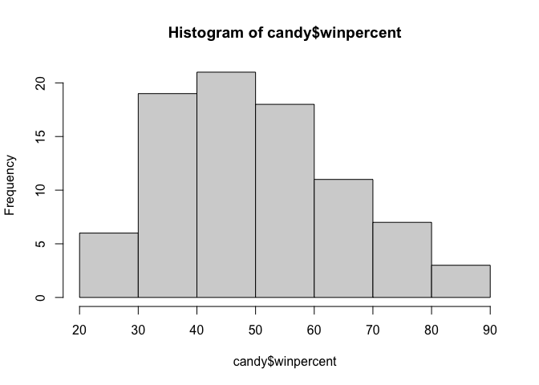
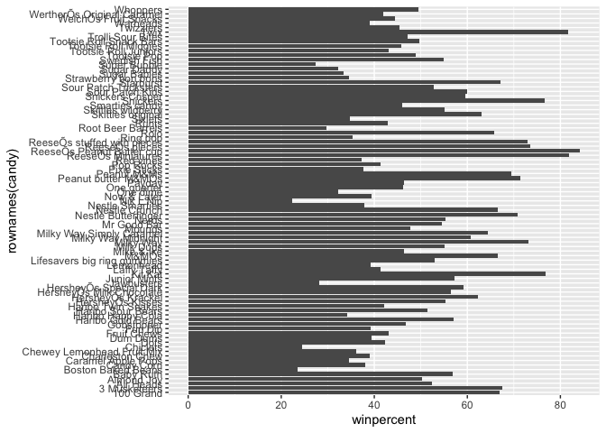
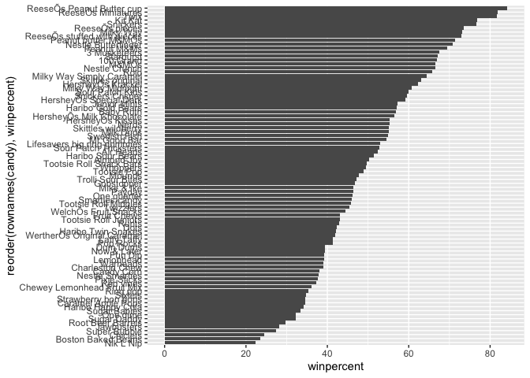
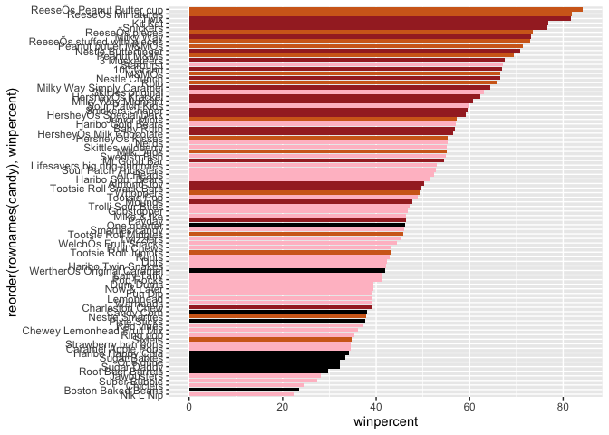
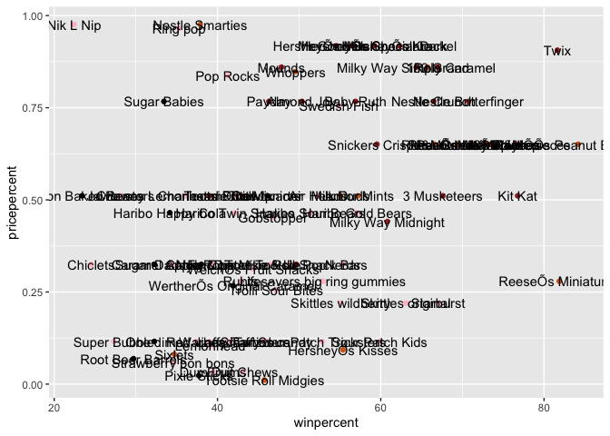
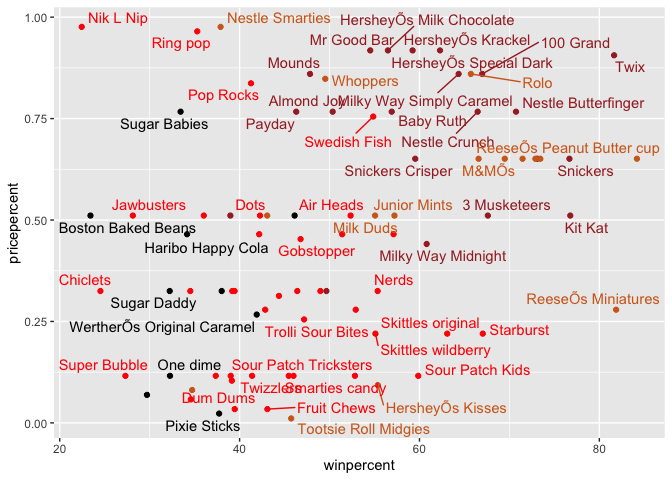
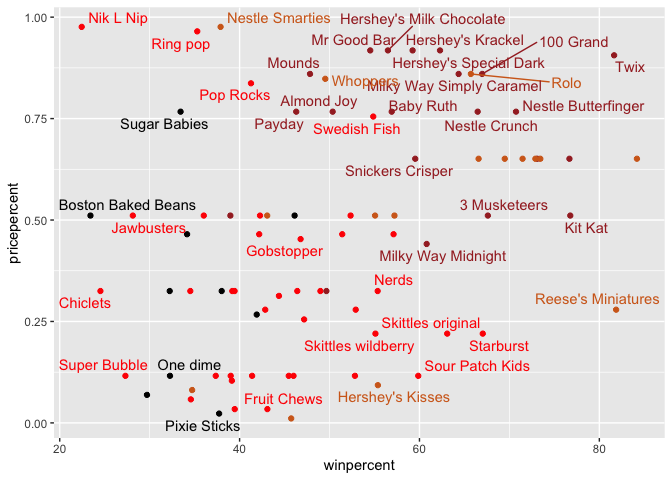
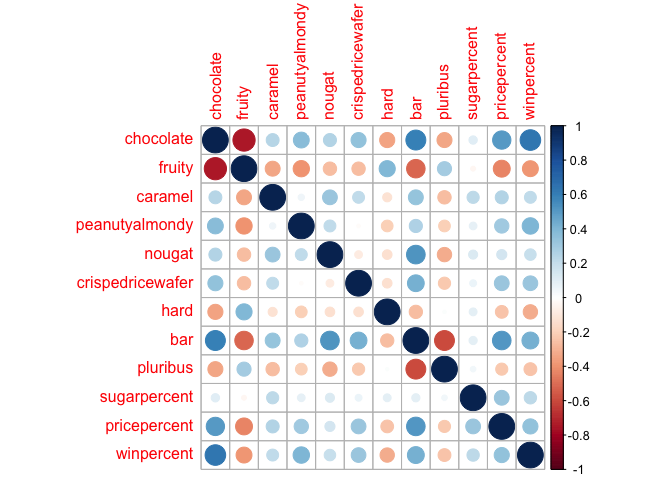
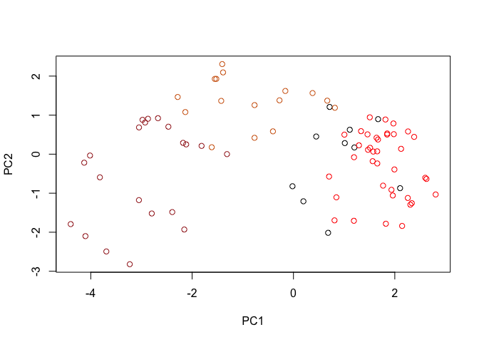
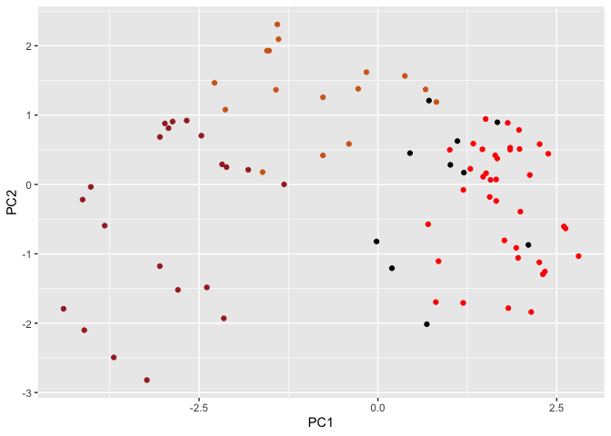

Class 10: Candy mini project
================
Barry (PID: 911)
10/29/2021

# Read the data

This comes from the 538 GitHub repo. They have lot’s of interesting
datasets.

``` r
url <- "https://raw.githubusercontent.com/fivethirtyeight/data/master/candy-power-ranking/candy-data.csv"

candy <- read.csv(url, row.names=1)
head(candy)
```

    ##              chocolate fruity caramel peanutyalmondy nougat crispedricewafer
    ## 100 Grand            1      0       1              0      0                1
    ## 3 Musketeers         1      0       0              0      1                0
    ## One dime             0      0       0              0      0                0
    ## One quarter          0      0       0              0      0                0
    ## Air Heads            0      1       0              0      0                0
    ## Almond Joy           1      0       0              1      0                0
    ##              hard bar pluribus sugarpercent pricepercent winpercent
    ## 100 Grand       0   1        0        0.732        0.860   66.97173
    ## 3 Musketeers    0   1        0        0.604        0.511   67.60294
    ## One dime        0   0        0        0.011        0.116   32.26109
    ## One quarter     0   0        0        0.011        0.511   46.11650
    ## Air Heads       0   0        0        0.906        0.511   52.34146
    ## Almond Joy      0   1        0        0.465        0.767   50.34755

``` r
gsub("Õ", "'", rownames(candy))
```

    ##  [1] "100 Grand"                   "3 Musketeers"               
    ##  [3] "One dime"                    "One quarter"                
    ##  [5] "Air Heads"                   "Almond Joy"                 
    ##  [7] "Baby Ruth"                   "Boston Baked Beans"         
    ##  [9] "Candy Corn"                  "Caramel Apple Pops"         
    ## [11] "Charleston Chew"             "Chewey Lemonhead Fruit Mix" 
    ## [13] "Chiclets"                    "Dots"                       
    ## [15] "Dum Dums"                    "Fruit Chews"                
    ## [17] "Fun Dip"                     "Gobstopper"                 
    ## [19] "Haribo Gold Bears"           "Haribo Happy Cola"          
    ## [21] "Haribo Sour Bears"           "Haribo Twin Snakes"         
    ## [23] "Hershey's Kisses"            "Hershey's Krackel"          
    ## [25] "Hershey's Milk Chocolate"    "Hershey's Special Dark"     
    ## [27] "Jawbusters"                  "Junior Mints"               
    ## [29] "Kit Kat"                     "Laffy Taffy"                
    ## [31] "Lemonhead"                   "Lifesavers big ring gummies"
    ## [33] "Peanut butter M&M's"         "M&M's"                      
    ## [35] "Mike & Ike"                  "Milk Duds"                  
    ## [37] "Milky Way"                   "Milky Way Midnight"         
    ## [39] "Milky Way Simply Caramel"    "Mounds"                     
    ## [41] "Mr Good Bar"                 "Nerds"                      
    ## [43] "Nestle Butterfinger"         "Nestle Crunch"              
    ## [45] "Nik L Nip"                   "Now & Later"                
    ## [47] "Payday"                      "Peanut M&Ms"                
    ## [49] "Pixie Sticks"                "Pop Rocks"                  
    ## [51] "Red vines"                   "Reese's Miniatures"         
    ## [53] "Reese's Peanut Butter cup"   "Reese's pieces"             
    ## [55] "Reese's stuffed with pieces" "Ring pop"                   
    ## [57] "Rolo"                        "Root Beer Barrels"          
    ## [59] "Runts"                       "Sixlets"                    
    ## [61] "Skittles original"           "Skittles wildberry"         
    ## [63] "Nestle Smarties"             "Smarties candy"             
    ## [65] "Snickers"                    "Snickers Crisper"           
    ## [67] "Sour Patch Kids"             "Sour Patch Tricksters"      
    ## [69] "Starburst"                   "Strawberry bon bons"        
    ## [71] "Sugar Babies"                "Sugar Daddy"                
    ## [73] "Super Bubble"                "Swedish Fish"               
    ## [75] "Tootsie Pop"                 "Tootsie Roll Juniors"       
    ## [77] "Tootsie Roll Midgies"        "Tootsie Roll Snack Bars"    
    ## [79] "Trolli Sour Bites"           "Twix"                       
    ## [81] "Twizzlers"                   "Warheads"                   
    ## [83] "Welch's Fruit Snacks"        "Werther's Original Caramel" 
    ## [85] "Whoppers"

> Q1. How many different candy types are in this dataset?

``` r
nrow(candy)
```

    ## [1] 85

> Q2. How many fruity candy types are in the dataset?

``` r
sum(candy$fruity)
```

    ## [1] 38

``` r
sum(candy$chocolate)
```

    ## [1] 37

``` r
library(skimr)
skim(candy)
```

|                                                  |       |
|:-------------------------------------------------|:------|
| Name                                             | candy |
| Number of rows                                   | 85    |
| Number of columns                                | 12    |
| \_\_\_\_\_\_\_\_\_\_\_\_\_\_\_\_\_\_\_\_\_\_\_   |       |
| Column type frequency:                           |       |
| numeric                                          | 12    |
| \_\_\_\_\_\_\_\_\_\_\_\_\_\_\_\_\_\_\_\_\_\_\_\_ |       |
| Group variables                                  | None  |

Data summary

**Variable type: numeric**

| skim_variable    | n_missing | complete_rate |  mean |    sd |    p0 |   p25 |   p50 |   p75 |  p100 | hist  |
|:-----------------|----------:|--------------:|------:|------:|------:|------:|------:|------:|------:|:------|
| chocolate        |         0 |             1 |  0.44 |  0.50 |  0.00 |  0.00 |  0.00 |  1.00 |  1.00 | ▇▁▁▁▆ |
| fruity           |         0 |             1 |  0.45 |  0.50 |  0.00 |  0.00 |  0.00 |  1.00 |  1.00 | ▇▁▁▁▆ |
| caramel          |         0 |             1 |  0.16 |  0.37 |  0.00 |  0.00 |  0.00 |  0.00 |  1.00 | ▇▁▁▁▂ |
| peanutyalmondy   |         0 |             1 |  0.16 |  0.37 |  0.00 |  0.00 |  0.00 |  0.00 |  1.00 | ▇▁▁▁▂ |
| nougat           |         0 |             1 |  0.08 |  0.28 |  0.00 |  0.00 |  0.00 |  0.00 |  1.00 | ▇▁▁▁▁ |
| crispedricewafer |         0 |             1 |  0.08 |  0.28 |  0.00 |  0.00 |  0.00 |  0.00 |  1.00 | ▇▁▁▁▁ |
| hard             |         0 |             1 |  0.18 |  0.38 |  0.00 |  0.00 |  0.00 |  0.00 |  1.00 | ▇▁▁▁▂ |
| bar              |         0 |             1 |  0.25 |  0.43 |  0.00 |  0.00 |  0.00 |  0.00 |  1.00 | ▇▁▁▁▂ |
| pluribus         |         0 |             1 |  0.52 |  0.50 |  0.00 |  0.00 |  1.00 |  1.00 |  1.00 | ▇▁▁▁▇ |
| sugarpercent     |         0 |             1 |  0.48 |  0.28 |  0.01 |  0.22 |  0.47 |  0.73 |  0.99 | ▇▇▇▇▆ |
| pricepercent     |         0 |             1 |  0.47 |  0.29 |  0.01 |  0.26 |  0.47 |  0.65 |  0.98 | ▇▇▇▇▆ |
| winpercent       |         0 |             1 | 50.32 | 14.71 | 22.45 | 39.14 | 47.83 | 59.86 | 84.18 | ▃▇▆▅▂ |

``` r
hist(candy$winpercent)
```

<!-- -->

> Q11. On average is chocolate candy higher or lower ranked than fruit
> candy?

``` r
choclate <- candy[ as.logical(candy$chocolate), ]$winpercent
mean(choclate)
```

    ## [1] 60.92153

``` r
fruity <- candy[as.logical(candy$fruity),]$winpercent
mean(fruity)
```

    ## [1] 44.11974

> Q12. Is this difference statistically significant

Yes!

``` r
t.test(choclate, fruity)
```

    ## 
    ##  Welch Two Sample t-test
    ## 
    ## data:  choclate and fruity
    ## t = 6.2582, df = 68.882, p-value = 2.871e-08
    ## alternative hypothesis: true difference in means is not equal to 0
    ## 95 percent confidence interval:
    ##  11.44563 22.15795
    ## sample estimates:
    ## mean of x mean of y 
    ##  60.92153  44.11974

# 3. Candy rankings

Let’s make a barplot of the winpercent values for the variouys candy
types

``` r
library(ggplot2)

ggplot(candy) +
  aes(winpercent, rownames(candy)) +
  geom_col()
```

<!-- -->

We need to improve this to reorder the candy by the winpercent valeus

``` r
ggplot(candy) +
  aes(winpercent, reorder(rownames(candy), winpercent)) +
  geom_col()
```

<!-- -->

## Time to add some color

``` r
# Color vector (all black to start)
my_cols=rep("black", nrow(candy))

# Now overwrite the chocolate entries with "chocolate"
my_cols[as.logical(candy$chocolate)] = "chocolate"
my_cols[as.logical(candy$bar)] = "brown"
my_cols[as.logical(candy$fruity)] = "pink"
```

``` r
my_cols
```

    ##  [1] "brown"     "brown"     "black"     "black"     "pink"      "brown"    
    ##  [7] "brown"     "black"     "black"     "pink"      "brown"     "pink"     
    ## [13] "pink"      "pink"      "pink"      "pink"      "pink"      "pink"     
    ## [19] "pink"      "black"     "pink"      "pink"      "chocolate" "brown"    
    ## [25] "brown"     "brown"     "pink"      "chocolate" "brown"     "pink"     
    ## [31] "pink"      "pink"      "chocolate" "chocolate" "pink"      "chocolate"
    ## [37] "brown"     "brown"     "brown"     "brown"     "brown"     "pink"     
    ## [43] "brown"     "brown"     "pink"      "pink"      "brown"     "chocolate"
    ## [49] "black"     "pink"      "pink"      "chocolate" "chocolate" "chocolate"
    ## [55] "chocolate" "pink"      "chocolate" "black"     "pink"      "chocolate"
    ## [61] "pink"      "pink"      "chocolate" "pink"      "brown"     "brown"    
    ## [67] "pink"      "pink"      "pink"      "pink"      "black"     "black"    
    ## [73] "pink"      "pink"      "pink"      "chocolate" "chocolate" "brown"    
    ## [79] "pink"      "brown"     "pink"      "pink"      "pink"      "black"    
    ## [85] "chocolate"

``` r
ggplot(candy) +
  aes(winpercent, reorder(rownames(candy), winpercent)) +
  geom_col(fill=my_cols)
```

<!-- -->

``` r
ggplot(candy) +
  aes(winpercent, pricepercent, label=rownames(candy)) +
  geom_point(col=my_cols) +
  geom_text()
```

<!-- -->

These labels suck. Let’s use the **ggrepl** package for better label
placment.

``` r
library(ggrepel)

# change my fruity color to red
my_cols[as.logical(candy$fruity)] <- "red"

ggplot(candy) +
  aes(winpercent, pricepercent, label=rownames(candy)) +
  geom_point(col=my_cols) +
  geom_text_repel(col=my_cols)
```

    ## Warning: ggrepel: 29 unlabeled data points (too many overlaps). Consider
    ## increasing max.overlaps

<!-- -->

``` r
rownames(candy) <- gsub("Õ", "'", rownames(candy))
```

``` r
ggplot(candy) +
  aes(winpercent, pricepercent, label=rownames(candy)) +
  geom_point(col=my_cols) +
  geom_text_repel(col=my_cols, max.overlaps = 7)
```

    ## Warning: ggrepel: 45 unlabeled data points (too many overlaps). Consider
    ## increasing max.overlaps

<!-- -->

# Correlation Analysis

``` r
library(corrplot)
```

    ## corrplot 0.92 loaded

``` r
cij <- cor(candy)
corrplot(cij)
```

<!-- -->

# Principla Componet analysis

``` r
pca <- prcomp(candy, scale=TRUE)
summary(pca)
```

    ## Importance of components:
    ##                           PC1    PC2    PC3     PC4    PC5     PC6     PC7
    ## Standard deviation     2.0788 1.1378 1.1092 1.07533 0.9518 0.81923 0.81530
    ## Proportion of Variance 0.3601 0.1079 0.1025 0.09636 0.0755 0.05593 0.05539
    ## Cumulative Proportion  0.3601 0.4680 0.5705 0.66688 0.7424 0.79830 0.85369
    ##                            PC8     PC9    PC10    PC11    PC12
    ## Standard deviation     0.74530 0.67824 0.62349 0.43974 0.39760
    ## Proportion of Variance 0.04629 0.03833 0.03239 0.01611 0.01317
    ## Cumulative Proportion  0.89998 0.93832 0.97071 0.98683 1.00000

# PCA score plot

``` r
plot(pca$x[,1:2], col=my_cols)
```

<!-- -->

ggplot version

``` r
# Make a new data-frame with our PCA results and candy data
my_data <- cbind(candy, pca$x[,1:3])

ggplot(my_data) +
  aes(PC1, PC2) +
  geom_point(col=my_cols)
```

<!-- -->
