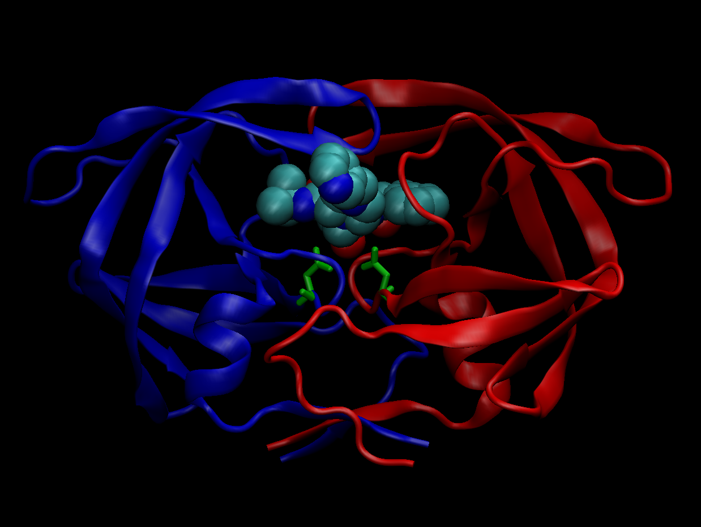

# The PDB database

It is 50 years old this year! I got some overview stats from here: <https://www.rcsb.org/stats/summary>

```{r}
db <- read.csv("Data Export Summary.csv", row.names = 1)
```

> Q1: What percentage of structures in the PDB are solved by X-Ray and Electron Microscopy.

```{r}
round((sum(db$X.ray) / sum(db$Total)) * 100, 2)
```

How about doing this over every method (i.e. column in the little table)

```{r}
round((colSums(db) / sum(db$Total)) * 100, 2)
```

> Q2: What percentage of structures in the PDB are protein?

```{r}
db$Total[1]
```

```{r}
db[1, ncol(db)]
```

```{r}
round((db$Total[1]/sum(db$Total)) * 100,2)
```




# Using Bio3D in R for structural bioinformatics

```{r}
library(bio3d)

pdb <- read.pdb("1hsg")
pdb
```

```{r}
pdb <- read.pdb("1hel")
pdb
```
```{r}
head(pdb$atom)
```
Do a Normal Mode Analysis (NMA) a prediction of the conformational variability and intrinsic dynamics of this protein.
```{r}
pdb <- read.pdb("1hel")
m <- nma(pdb)
plot(m)
```
Make a little movie (trajectory) for viewing in VMD.
```{r}
mktrj(m, file="nma.pdb")
```


